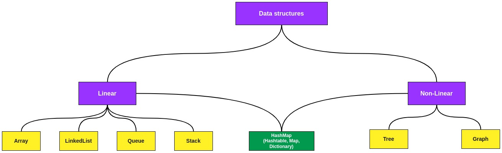
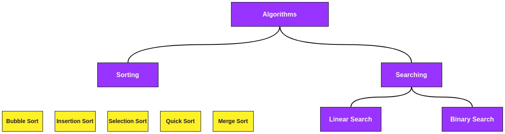

# Data structures and Algorithms (DSA)

## About

### Data structures

Data structures are a specialized manner of organizing and storing data in computers in such a way that we can perform operations on the stored data more efficiently.They have a wide and diverse scope of usage across the fields of Computer Science and Software Engineering.

### Algorithms

Algorithms are sets of steps for solving problems. Basic algorithms include sorting, searching, and recursion.

## The Project

This repository contains documentation for each data structure and algorithm mentioned. You can navigate under the directories to find out more about each one of them.
